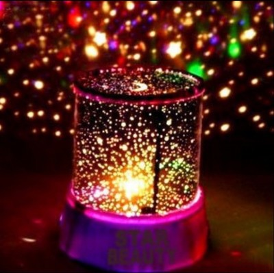
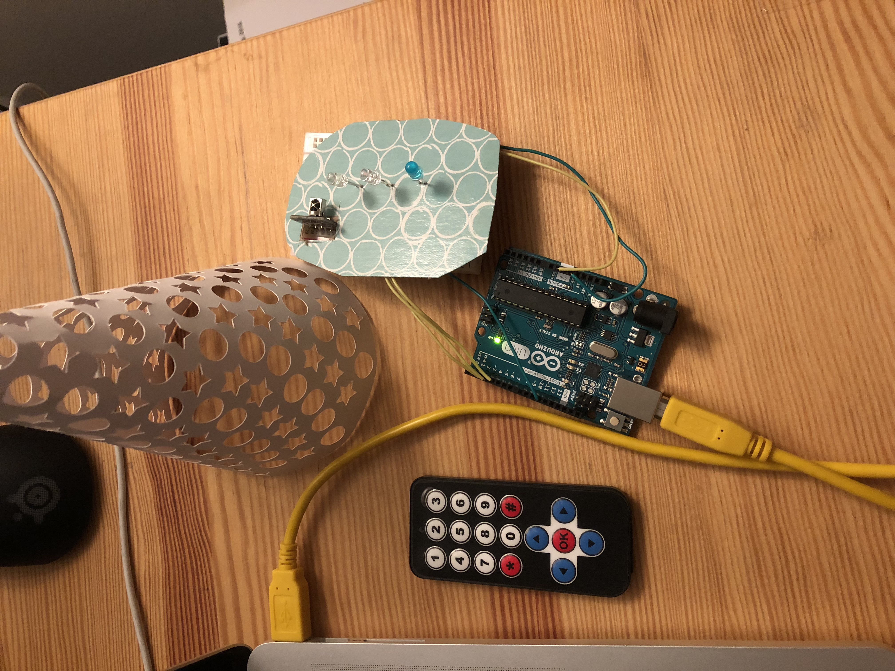

# CIM 542 Final Project

## Name of the project：Star projector

## Inspiration

### I want to make something myself for my friend as a birthday gifts. I saw there are some decent star projector in the market, but I just have capability to make a simplified edition for my friend.

## Ideal size
### The ideal size of my star projector should be 8in * 11in * 11in, which is similar size to table lamp. 

## Input
### The input is infrared sensor. Users can change the Light variations by clicking the remote. 

## Output
### The output is the LED lights and light variations. 

## Components used in this project

* Arduino Uno
* Breadboard
* Wires
* 3 diffrent colors LED lights
* Infrared sensor and remote
* 100 pounds paper

## How the code works?
### I connected the infrared sensor to pin 11 and connected 3 LED lights of different colors to Pin 2, Pin 3, and Pin 4 respectively. Press button 1 will give me police car lights variation. Press button 2 will give me airplane blinking light variation. Press button 3 will give me fire alarm light variation. Each light variation should light up with different lights and lighting frequencies. I tried to assign the delay function matching with my real life experiences. For example, police car light variation is more emergency with both blue and red lights on; the airplane blinking light is less frequency to remind other aircraft to not get too close to our airplane; 

## If I had more time
### If I had more time, I would make a base for the body and connect the base with an engine, so the star projector can rotate and looks more pretty. 

## Images

## Video

[Star Projector Video](https://www.youtube.com/watch?v=6YI9B_2OqjQ&feature=youtu.be)

 
